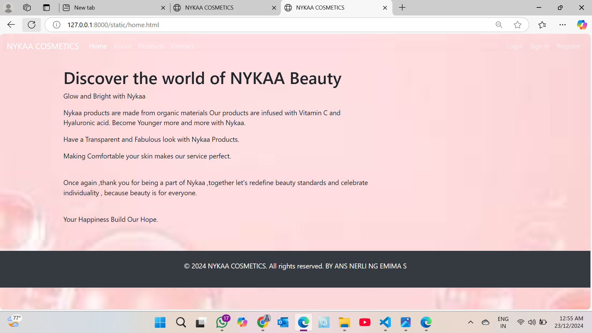
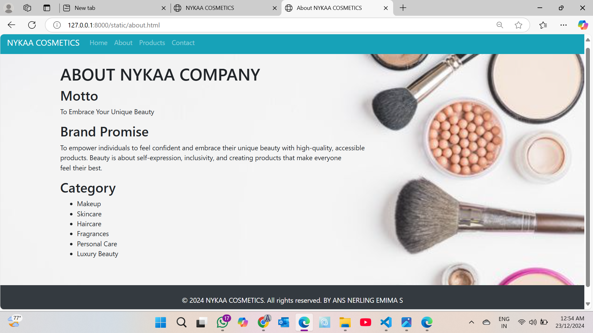
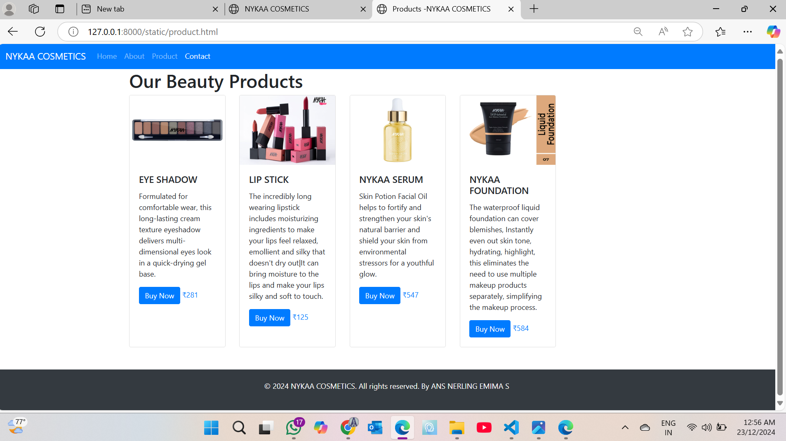
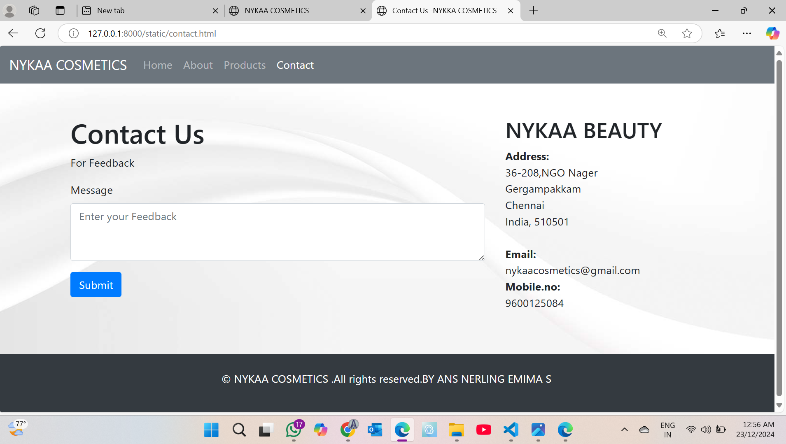

# Project Responsive Web Design using Bootstrap
## Date:23.12.2024

## AIM:
To create a simplified clone of Dribbble (https://dribbble.com/) landing page.


## DESIGN STEPS:

### Step 1:
Clone the repository from GitHub.

### Step 2:
Create Django Admin project.

### Step 3:
Create a New App under the Django Admin project.

### Step 4:
Insert the necessary CSS and JavaScript files as external in order to use Bootstrap.

### Step 5:
Create a HTML file and include the needed Bootstrap components.

### Step 6:
Publish the website in the LocalHost.

## PROGRAM :
```
home.html

<!DOCTYPE html>
<html lang="en">
<head>
  <meta charset="UTF-8">
  <meta name="viewport" content="width=device-width, initial-scale=1.0">
  <title>NYKAA COSMETICS</title>
  <!-- Bootstrap CSS -->
  <link href="https://stackpath.bootstrapcdn.com/bootstrap/4.5.2/css/bootstrap.min.css" rel="stylesheet">
</head>
<body>

  <!-- Navbar -->
  <nav class="navbar navbar-expand-lg navbar-dark bg-link">
    <a class="navbar-brand" href="#">NYKAA COSMETICS</a>
    <button class="navbar-toggler" type="button" data-toggle="collapse" data-target="#navbarSupportedContent" aria-controls="navbarSupportedContent" aria-expanded="false" aria-label="Toggle navigation">
      <span class="navbar-toggler-icon"></span>
    </button>

    <div class="collapse navbar-collapse" id="navbarSupportedContent">
      <ul class="navbar-nav mr-auto">
        <li class="nav-item active">
          <a class="nav-link" href="home.html">Home <span class="sr-only">(current)</span></a>
        </li>
        <li class="nav-item">
          <a class="nav-link" href="about.html">About</a>
        </li>
        <li class="nav-item">
          <a class="nav-link" href="product.html">Products</a>
        </li>
        <li class="nav-item">
          <a class="nav-link" href="contact.html">Contact</a>
        </li>
      </ul>
      <ul class="navbar-nav ml-auto">
        <li class="nav-item">
          <a class="nav-link" href="#">Login</a>
        </li>
        <li class="nav-item">
          <a class="nav-link" href="#">Sign In</a>
        </li>
        <li class="nav-item">
          <a class="nav-link" href="#">Register</a>
        </li>
      </ul>
    </div>
  </nav>

  <!-- Page Content -->
  <div class="container mt-4">
    <div class="row">
      <div class="col-md-8">
        <h1>Discover the world of NYKAA Beauty</h1>
        <p>  Glow and Bright with Nykaa
         </p>
        <p>Nykaa products are made from organic materials Our products are infused with Vitamin C and Hyaluronic acid.
           Become Younger more and more with Nykaa.
        </p>
        <p> Have a Transparent and Fabulous look with Nykaa Products. </p>
        <p>Making Comfortable your skin makes our service perfect.</p>
        <br>
        <p>Once again ,thank you for being a part of Nykaa ,together let's redefine beauty standards and celebrate individuality , because beauty is for everyone.</p>
        <br>
        <p>Your Happiness Build Our Hope.</p>
      </div>
      <div class="col-md-5">
       
      </div>
    </div>
  </div>
  <body background="cosmet.jpg" style="background-repeat: no-repeat; background-size: cover;">


  <!-- Footer -->
  <footer class="bg-dark text-white text-center py-4 mt-5">
    <p>&copy; 2024 NYKAA COSMETICS. All rights reserved. BY ANS NERLING EMIMA S</p>
  </footer>

  <!-- Bootstrap JS -->
  <script src="https://code.jquery.com/jquery-3.5.1.slim.min.js"></script>
  <script src="https://cdn.jsdelivr.net/npm/popper.js@1.16.1/dist/umd/popper.min.js"></script>
  <script src="https://stackpath.bootstrapcdn.com/bootstrap/4.5.2/js/bootstrap.min.js"></script>
</body>
</html>

about.html

<!DOCTYPE html>
<html lang="en">
<head>
  <meta charset="UTF-8">
  <meta name="viewport" content="width=device-width, initial-scale=1.0">
  <title>About NYKAA COSMETICS</title>
  <!-- Bootstrap CSS -->
  <link href="https://stackpath.bootstrapcdn.com/bootstrap/4.5.2/css/bootstrap.min.css" rel="stylesheet">
</head>
<body>

  <!-- Navbar -->
  <nav class="navbar navbar-expand-lg navbar-dark bg-info">
    <a class="navbar-brand" href="#">NYKAA COSMETICS</a>
    <button class="navbar-toggler" type="button" data-toggle="collapse" data-target="#navbarSupportedContent" aria-controls="navbarSupportedContent" aria-expanded="false" aria-label="Toggle navigation">
      <span class="navbar-toggler-icon"></span>
    </button>

    <div class="collapse navbar-collapse" id="navbarSupportedContent">
      <ul class="navbar-nav mr-auto">
        <li class="nav-item">
          <a class="nav-link" href="home.html">Home</a>
        </li>
        <li class="nav-item">
          <a class="nav-link" href="about.html">About</a>
        </li>
        <li class="nav-item">
          <a class="nav-link" href="product.html">Products</a>
        </li>
        <li class="nav-item">
          <a class="nav-link" href="#">Contact</a>
        </li>
      </ul>
    </div>
  </nav>

  <!-- Page Content -->
  <div class="container mt-4">
    <div class="row">
      <div class="col-md-8">
        <h1>ABOUT NYKAA COMPANY</h1>
        <div id="motto">
          <h2>Motto</h2>
          <p>To Embrace Your Unique Beauty</p>
        </div>
        <div id="Brand promise">
          <h2>Brand Promise</h2>
          <p>To empower individuals to feel confident and embrace their unique beauty with high-quality, accessible products.
             Beauty is about self-expression, inclusivity, and creating products that make everyone feel their best.</p>
        </div>
        <div id="category">
          <h2>Category</h2>
          <ul>
            <li>Makeup </li> 
            <li> Skincare </li>
             <li>Haircare </li>
             <li>Fragrances</li>
             <li>Personal Care</li>
             <li>Luxury Beauty </li>
             </ul>
        </div>
        <!-- Add more subheadings as needed -->
      </div>
    </div>
  </div>
  <body background="cosmet3.jpg" style="background-repeat: no-repeat; background-size: cover;"></body>
  <!-- Footer -->
  <footer class="bg-dark text-white text-center py-4 mt-5">
    <p>&copy; 2024 NYKAA COSMETICS. All rights reserved.  BY ANS NERLING EMIMA S</p>
  </footer>

  <!-- Bootstrap JS -->
  <script src="https://code.jquery.com/jquery-3.5.1.slim.min.js"></script>
  <script src="https://cdn.jsdelivr.net/npm/popper.js@1.16.1/dist/umd/popper.min.js"></script>
  <script src="https://stackpath.bootstrapcdn.com/bootstrap/4.5.2/js/bootstrap.min.js"></script>
</body>
</html>

product.html

<!DOCTYPE html>
<html lang="en">
<head>
  <meta charset="UTF-8">
  <meta name="viewport" content="width=device-width, initial-scale=1.0">
  <title>Products -NYKAA COSMETICS </title>
  <!-- Bootstrap CSS -->
  <link href="https://stackpath.bootstrapcdn.com/bootstrap/4.5.2/css/bootstrap.min.css" rel="stylesheet">
</head>
<body>

  <!-- Navbar -->
  <nav class="navbar navbar-expand-lg navbar-dark bg-primary">
    <a class="navbar-brand" href="#">NYKAA COSMETICS</a>
    <button class="navbar-toggler" type="button" data-toggle="collapse" data-target="#navbarSupportedContent" aria-controls="navbarSupportedContent" aria-expanded="false" aria-label="Toggle navigation">
      <span class="navbar-toggler-icon"></span>
    </button>
    <div class="collapse navbar-collapse" id="navbarSupportedContent">
      <ul class="navbar-nav mr-auto">
        <li class="nav-item">
          <a class="nav-link" href="home.html">Home</a>
        </li>
        <li class="nav-item">
          <a class="nav-link" href="about.html">About</a>
        </li>
        <li class="nav-item">
            <a class="nav-link" href="product.html">Product</a>
          </li>
       
        <li class="nav-item active">
          <a class="nav-link" href="contact.html">Contact</a>
        </li>
      </ul>
  </nav>

  <!-- Page Content -->
  <div class="container mt-12">
    <div class="row">
      <div class="col-md-10">
        <h1>Our Beauty Products</h1>
        <div class="card-deck">
          <div class="card">
            
            <div class="card-body">
              <h5 class="card-title">EYE SHADOW</h5>
              <p class="card-text">Formulated for comfortable wear, this long-lasting cream texture eyeshadow delivers multi-dimensional eyes look in a quick-drying gel base.</p>
              <a href="#" class="btn btn-primary">Buy Now</a>
              <a href="#">₹281</a>
              
            </div>
          </div>
          <div class="card">
            
            <div class="card-body">
              <h5 class="card-title">LIP STICK</h5>
              <p class="card-text">
                The incredibly long wearing lipstick includes moisturizing ingredients to make your lips feel relaxed, emollient and silky that doesn't dry out|It can bring moisture to the lips and make your lips silky and soft to touch.</p>
              <a href="#" class="btn btn-primary">Buy Now</a>
              <a href="#">₹125</a>
              
            </div>
          </div>
          <div class="card">
              
                <div class="card-body">
              <h5 class="card-title">NYKAA SERUM</h5>
              <p class="card-text"> Skin Potion Facial Oil helps to fortify and strengthen your skin's natural barrier and shield your skin from environmental stressors for a youthful glow.</p>
              <a href="#" class="btn btn-primary">Buy Now</a>
              <a href="#">₹547</a>
              
              </div>
            </div>
         <div class="card">
                
                <div class="card-body">
                  <h5 class="card-title">NYKAA FOUNDATION</h5>
                  <p class="card-text">The waterproof liquid foundation can cover blemishes, Instantly even out skin tone, hydrating, highlight, this eliminates the need to use multiple makeup products separately, simplifying the makeup process.</p>
                  <a href="#" class="btn btn-primary">Buy Now</a>
                  <a href="#">₹584</a>
                  
              
            </div>
          </div>
          
      
        </div>
      </div>
    </div>
  </div>

  <!-- Footer -->
  <footer class="bg-dark text-white text-center py-4 mt-5">
    <p>&copy; 2024 NYKAA COSMETICS. All rights reserved. By ANS NERLING EMIMA S</p>
  </footer>
  


  <!-- Bootstrap JS -->
  <script src="https://code.jquery.com/jquery-3.5.1.slim.min.js"></script>
  <script src="https://cdn.jsdelivr.net/npm/popper.js@1.16.1/dist/umd/popper.min.js"></script>
  <script src="https://stackpath.bootstrapcdn.com/bootstrap/4.5.2/js/bootstrap.min.js"></script>
</body>
</html>

contact.html

<!DOCTYPE html>
<html lang="en">
<head>
  <meta charset="UTF-8">
  <meta name="viewport" content="width=device-width, initial-scale=1.0">
  <title>Contact Us -NYKKA COSMETICS</title>
  <!-- Bootstrap CSS -->
  <link href="https://stackpath.bootstrapcdn.com/bootstrap/4.5.2/css/bootstrap.min.css" rel="stylesheet">
</head>
<body>

  <!-- Navbar -->
  <nav class="navbar navbar-expand-lg navbar-dark bg-secondary">
    <a class="navbar-brand" href="#">NYKAA COSMETICS</a>
    <button class="navbar-toggler" type="button" data-toggle="collapse" data-target="#navbarSupportedContent" aria-controls="navbarSupportedContent" aria-expanded="false" aria-label="Toggle navigation">
      <span class="navbar-toggler-icon"></span>
    </button>

    <div class="collapse navbar-collapse" id="navbarSupportedContent">
      <ul class="navbar-nav mr-auto">
        <li class="nav-item">
          <a class="nav-link" href="home.html">Home</a>
        </li>
        <li class="nav-item">
          <a class="nav-link" href="about.html">About</a>
        </li>
        <li class="nav-item">
          <a class="nav-link" href="product.html">Products</a>
        </li>
        <li class="nav-item active">
          <a class="nav-link" href="contact.html">Contact <span class="sr-only">(current)</span></a>
        </li>
      </ul>
    </div>
  </nav>

  <!-- Page Content -->
  <div class="container mt-5">
    <div class="row">
      <div class="col-md-8">
        <h1>Contact Us</h1>
        <p>For Feedback</p>
        <form>
          <div class="form-group">
            <label for="message">Message</label>
            <textarea class="form-control" id="message" rows=3" placeholder="Enter your Feedback"></textarea>
          </div>
          <button type="submit" class="btn btn-primary">Submit</button>
        </form>
      </div>
      <div class="col-md-4">
        <h2>NYKAA BEAUTY</h2>
        <address>
          <strong>Address:</strong><br>
          36-208,NGO Nager<br>
          Gergampakkam<br>Chennai<br>
          India, 510501<br><br>
          <strong>Email:</strong><br>
          nykaacosmetics@gmail.com<br>
          <strong>Mobile.no:</strong><br>
          9600125084
        </address>
      </div>
    </div>
  </div>
  <body background="back.jpg" style="background-repeat: no-repeat; background-size: cover;">


  <!-- Footer -->
  <footer class="bg-dark text-white text-center py-4 mt-5">
    <p>&copy; NYKAA COSMETICS .All rights reserved.BY ANS NERLING EMIMA S</p>

  <!-- Bootstrap JS -->
  <script src="https://code.jquery.com/jquery-3.5.1.slim.min.js"></script>
  <script src="https://cdn.jsdelivr.net/npm/popper.js@1.16.1/dist/umd/popper.min.js"></script>
  <script src="https://stackpath.bootstrapcdn.com/bootstrap/4.5.2/js/bootstrap.min.js"></script>
</body>
</html>
```


## OUTPUT:






## RESULT:
The Project for responsive web design using Bootstrap is completed successfully.
